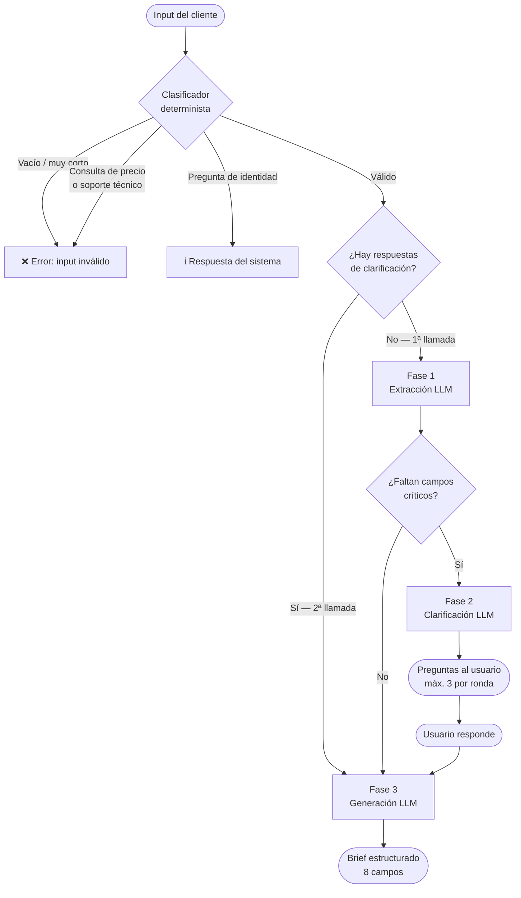

# Brief Generator

**Convierte textos desordenados de clientes en briefs de branding estructurados y accionables.**

Proyecto #2 del portfolio técnico — perfil híbrido Marketing + IA.

---

## Problema de negocio

Las agencias de estrategia de marca reciben constantemente inputs caóticos: emails con preferencias estéticas mezcladas con objetivos de negocio, notas que confunden síntoma con problema, o documentos donde el deseo de "algo moderno" ocupa el lugar de un público objetivo definido.

El estratega pasa horas haciendo preguntas de diagnóstico antes de poder arrancar. Este sistema automatiza esa primera fase: extrae lo que hay, identifica los vacíos críticos, hace las preguntas correctas y genera un brief estructurado listo para trabajar.

---

## Arquitectura



### Flujo de datos

| Llamada | Endpoint | Payload | Respuesta |
|---------|----------|---------|-----------|
| 1ª | `POST /api/process` | `{ text }` | `needs_clarification` + preguntas **o** `ready` + brief |
| 2ª | `POST /api/process` | `{ text, answers[] }` | `ready` + brief |

Diseño **stateless**: el cliente concatena el contexto entre llamadas. El servidor no almacena nada.

---

## Decisiones técnicas

### Clasificador determinista antes del LLM
Inputs vacíos, demasiado cortos (<20 palabras), consultas de precio o soporte técnico se rechazan con `if/in` antes de llamar a la API. Ahorra tokens, acelera la respuesta y hace el sistema más robusto.

### Una sola ronda de clarificación
El sistema pregunta una vez (máximo 3 preguntas) y genera. No entra en bucles infinitos. Los campos que siguen sin información se marcan explícitamente en el brief.

### Haiku sobre modelos más potentes
La tarea es extracción y estructuración, no razonamiento complejo. Haiku es más rápido y barato para este caso de uso.

### El sistema nunca inventa
Tres estados posibles para cada campo: proporcionado (desarrollado), inferido (marcado), ausente (declarado). Sin alucinaciones silenciosas.

### Prompts como archivos externos
`prompts/system_prompt.txt` centraliza el contexto del sistema y se pasa como parámetro `system` en todas las llamadas a la API. Facilita la iteración de prompts sin tocar código.

---

## Stack

| Capa | Tecnología |
|------|-----------|
| Backend | FastAPI + Python 3.11+ |
| LLM | Claude Haiku (`claude-haiku-4-5-20251001`) |
| Frontend | HTML / CSS / JS vanilla |
| Servidor | Uvicorn |
| Deploy | Render (Web Service) |
| VCS | GitHub |

---

## Estructura del proyecto

```
brief-generator/
├── api.py              # FastAPI app + StaticFiles
├── main.py             # Orquestador de las tres fases
├── config.py           # Campos del brief, umbrales, patrones de clasificación
├── core/
│   ├── classifier.py   # Clasificador determinista (pre-LLM)
│   ├── extractor.py    # Fase 1: extracción de campos
│   ├── clarifier.py    # Fase 2: generación de preguntas
│   ├── generator.py    # Fase 3: generación del brief
│   └── identity.py     # Respuesta a preguntas sobre el sistema
├── prompts/
│   └── system_prompt.txt
├── static/
│   └── index.html      # Frontend completo
├── tests/
│   ├── conftest.py
│   └── test_flujo.py   # Tests de comportamiento por fase
├── requirements.txt
├── .gitignore
└── README.md
```

---

## Cómo correrlo localmente

### 1. Clonar y crear entorno

```bash
git clone <repo-url>
cd brief-generator
python -m venv venv
source venv/bin/activate        # Windows: venv\Scripts\activate
pip install -r requirements.txt
```

### 2. Configurar API key

```bash
export ANTHROPIC_API_KEY="sk-ant-..."
```

### 3. Arrancar el servidor

```bash
uvicorn api:app --reload
```

Abre `http://localhost:8000` en el navegador.

### 4. Ejecutar tests

```bash
pytest tests/ -v
```

Los tests mockean la API de Anthropic; no requieren API key real.

---

## Deploy en Koyeb

1. Conecta el repo en [koyeb.com](https://koyeb.com) → New App → GitHub
2. Koyeb detecta `koyeb.yaml` automáticamente
3. Añade `ANTHROPIC_API_KEY` en el dashboard (Environment → Add variable)
4. Deploy

URL de producción: [URL obtenida tras el deploy]

---

## Endpoints

| Método | Ruta | Descripción |
|--------|------|-------------|
| GET | `/api/health` | Estado del servicio |
| POST | `/api/process` | Procesar input y generar brief |

### POST /api/process

**Request — primera llamada:**
```json
{
  "text": "Somos una startup de alimentación saludable..."
}
```

**Request — segunda llamada (con respuestas de clarificación):**
```json
{
  "text": "Somos una startup de alimentación saludable...",
  "answers": [
    {
      "question": "¿Cuál es el resultado concreto que buscáis con este proyecto de branding?",
      "answer": "Queremos entrar en el canal retail antes de Q3."
    }
  ]
}
```

**Posibles valores de `status` en la respuesta:**

| status | descripción |
|--------|-------------|
| `ready` | Brief generado — campo `brief` presente |
| `needs_clarification` | Faltan campos críticos — campo `questions` presente |
| `identity` | El input era una pregunta sobre el sistema — campo `message` presente |
| `invalid` | Input vacío, demasiado corto o fuera de contexto — campo `message` presente |
| `error` | Error interno o fallo de API — campo `message` presente |

**Response — `needs_clarification`:**
```json
{
  "status": "needs_clarification",
  "questions": [
    "¿Cuál es el resultado concreto que buscáis con este proyecto de branding?",
    "¿A quién va dirigida vuestra marca?",
    "¿Cuáles son vuestros competidores directos?"
  ]
}
```

**Response — `ready`:**
```json
{
  "status": "ready",
  "brief": {
    "context": "...",
    "objectives": "...",
    "target_audience": "...",
    "...": "..."
  }
}
```

---

## Ejemplos de input / output

### Input con información completa (flujo directo)

```
Somos Nómada Studio, un colectivo de 4 fotógrafos fundado en 2019 que documenta 
comunidades rurales en Latinoamérica. Queremos redefinir nuestra marca porque los 
clientes actuales (ONGs y fundaciones europeas con presupuesto medio de 20-50k€) 
no perciben el rigor periodístico de nuestro trabajo. El objetivo es posicionarnos 
como referente en fotografía documental con impacto social para captar 3 nuevos 
clientes institucionales antes de Q3 2025. Nos diferenciamos de agencias como 
Magnum por nuestro conocimiento local y acceso a comunidades.
```

**Resultado:** Brief completo en una llamada. Flujo: extracción → todos los campos críticos presentes → generación.

---

### Input incompleto (flujo con clarificación)

```
Hola, somos una startup de alimentación saludable. Llevamos 2 años y queremos 
renovar nuestra imagen porque sentimos que no conectamos con nuestro cliente. 
Nos gustan marcas minimalistas y naturales, tipo Oatly o Innocent. Tenemos 
presupuesto limitado y necesitamos algo para antes del verano.
```

**Preguntas generadas:**
1. ¿Cuál es el resultado concreto que buscáis con este proyecto de branding? (p.ej. aumentar ventas, entrar en un canal nuevo, relanzar un producto)
2. ¿A quién va dirigida vuestra marca? Describid a vuestro comprador ideal: edad, estilo de vida, dónde compra, qué valora.
3. ¿Cuáles son vuestros competidores directos en España y en qué os diferenciáis de ellos?

---

## Campos del brief

| # | Campo | Crítico | Inferable |
|---|-------|---------|-----------|
| 1 | Contexto y antecedentes | ✓ | — |
| 2 | Misión, Visión y Valores | — | ✓ |
| 3 | Objetivos del proyecto | ✓ | — |
| 4 | Público objetivo | ✓ | — |
| 5 | Análisis de la competencia | — | — |
| 6 | Personalidad de la marca | — | ✓ |
| 7 | Promesa y beneficio principal | — | ✓ |
| 8 | Restricciones y requisitos logísticos | — | — |

**Crítico:** sin estos 3 campos, el sistema pide clarificación antes de generar.  
**Inferable:** si no se proporcionan, el modelo los deduce del contexto y los marca.

---

## Limitaciones conocidas

- **Una sola ronda de clarificación.** Si las respuestas del usuario siguen siendo insuficientes, el brief se genera con los datos disponibles (marcando los vacíos).
- **Sin persistencia.** Cada sesión es independiente. No hay historial de briefs generados.
- **Clasificador de idioma único.** Los patrones de detección out-of-context están en español. Textos en otros idiomas pasarán el clasificador sin problema, pero el brief se generará en español.
- **Dependencia de la API de Anthropic.** Sin conexión o con rate limits altos, el servicio no funciona. No hay fallback offline.
- **Haiku tiene contexto limitado.** Textos de cliente muy largos (>10.000 palabras) pueden truncarse internamente.
